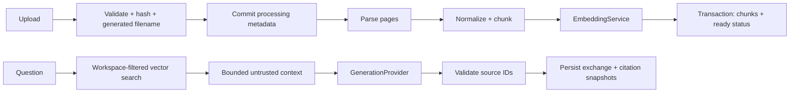

# Architecture

## Boundaries and data flow

The browser owns presentation and cache state (TanStack Query); it never sees a provider key. FastAPI routers validate transport schemas, repositories apply relational scope, services coordinate work, and rag/providers hold replaceable retrieval and AI boundaries.

## Schema

- Workspace: UUID, name, timestamp. Collection and workspace mean the same thing in V1.
- Document: workspace FK, original display name, opaque storage name, MIME, bytes, SHA-256, state, page count, chunk count, embedding model, timestamps, safe error text.
- DocumentChunk: document FK with ON DELETE CASCADE, sequence, optional page, text, metadata JSONB, vector(1024), timestamp.
- Conversation: workspace FK, title, timestamp.
- Message: conversation FK with cascade, role, content, citation JSONB snapshots, timestamp.

Uniqueness on (workspace_id, sha256) is the race-safe duplicate barrier. A preliminary check improves error reporting. Indexes cover workspace/document/conversation foreign keys. There is no HNSW index in V1: exact vector search preserves recall and filtering semantics for a small corpus. Add an ANN index only after measuring scale and filtered recall.

Alembic's initial migration explicitly declares tables, constraints and vector extension. It does not import a mutable future model to construct the historical schema.

## Ingestion and transactions

Uploads are bounded twice: total HTTP body (file limit plus multipart allowance) and file bytes. The body and parsed text are bounded in memory. Extension/MIME allowlisting accepts generic application/octet-stream for browser compatibility, then checks PDF/DOCX signatures and strict UTF-8 TXT decoding. Parsers validate actual format. This is not antivirus.

The original is written under a generated UUID filename. Metadata commits as processing before parsing. Parsing/chunking run in a thread pool so CPU work does not directly block the event loop. Embeddings are asynchronous, batched at 16 chunks. Output vectors must have the expected count, finite values, correct dimensions and nonzero norm.

Final chunks and ready state commit together. Embedding/parsing failures store failed state without partial vectors. Provider details are not included in errors. A concurrent document delete is detected by locking/checking the document during finalization. No queue exists; a hard process crash can leave processing rows and filesystem orphans. Delete/reupload is recovery for V1.

Database deletion cascades vectors, then removes the original file. A file cleanup failure returns an explicit error and logs only the document ID. Database and filesystem are not one atomic transaction; a future outbox/garbage collector should close that gap.

## Chunking baseline

The replaceable Chunker protocol takes parsed Page objects and returns ordered chunks. WordChunker uses **350 words with 50-word overlap**, within each PDF page. About 14% overlap reduces boundary loss for short policy/report paragraphs without duplicating most content. Short pages remain one short chunk; windows never blend PDF page numbers.

These numbers are a starting hypothesis, not tuned results. English word counts are only a rough token proxy. A separate **6000-character cap** also splits pathological long tokens and limits provider input. NFKC normalization, control-character removal and whitespace folding make text stable; this loses tables/paragraph layout and can change typography. Chunk metadata records filename and strategy version; the relational FK preserves document identity.

Weaknesses: sentence boundaries may be cut; cross-page context can be lost; Arabic and languages without spaces have different token density; DOCX tables flatten; large PDFs consume CPU/memory. Alternatives to evaluate: tokenizer-aware sentence windows, recursive headings/paragraphs, parent-child chunks, layout/table-aware extraction, semantic boundaries, adaptive overlap. Record document version, extraction version and chunk configuration in a future reindex schema.

## Retrieval and generation

VectorRetriever queries only ready documents in the requested workspace and optional document IDs. It checks embedding-model compatibility first. No eligible documents means no embedding call. Cosine top-k defaults to six. V1 does not apply a global similarity cutoff because embedding scores are uncalibrated: the real overview query "what is this doc about" scored below an unrelated parental-leave query. The grounded generator receives the nearest candidates and must explicitly abstain when they do not support an answer.

RAGPipeline truncates questions and bounds retrieved context to 24000 characters. Sources are JSON-encoded under untrusted_context; text never becomes a system message. It uses no tools, execution, browsing or secret-bearing context. The system prompt asks for supplied evidence only and explicit abstention.

The provider returns ModelAnswer (answer, source_ids, insufficient_context) through structured outputs. The application rejects any unknown ID and any supported answer without a source. The application builds citation filename/page/snippet from supplied source objects, never from model-proposed metadata. Insufficient evidence yields a fixed abstention without unsupported speculation.

This checks structure and identity, not entailment. The LLM could cite a real passage that does not support its claim. Only a labeled evaluation set and human review can establish quality.

## Conversations

Successful user/assistant pairs commit together. A row lock serializes turns per conversation. On a provider error neither half is saved. Timestamps order the exchange. History is shown in the UI but is not fed back into generation: standalone questions avoid history contamination and stale evidence in Phase 1.

Citations contain answer-time snapshots so source inspection remains understandable after reindexing/deletion. Deleting a document removes its original and searchable index, not historical text. Conversation deletion is the separate historical-data removal mechanism.

## Extension points

- GenerationProvider: add Anthropic adapter; keep ModelAnswer validation in the pipeline.
- EmbeddingProvider / EmbeddingService: local Ollama or optional OpenAI engines with an explicit query/document purpose.
- Retriever: BM25, hybrid fusion or reranking without changing the chat API.
- Chunker: experiment without changing parsers or provider adapters.
- OCRProvider: extract missing PDF page text; currently no concrete OCR implementation.
- FileStorage: local original storage can become a blob adapter alongside a deletion outbox.
- Identity: resolve trusted principal and authorized workspace at the dependency boundary; never treat a supplied UUID as authorization.

## Operational shape

Compose: PostgreSQL 16/pgvector, Python 3.12 API, Node 22 Next.js build. API startup runs Alembic for a single-instance developer deployment. Multiple replicas should use a separate migration job. Nonroot application containers and loopback host ports are defaults. Request IDs and JSON event logs intentionally exclude questions, source passages and filenames.
