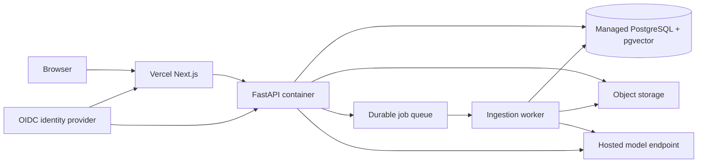

# Public production plan

## Current release status

The repository is suitable for public code review and local Phase 1 testing. The application is not safe to expose as a public multi-user service. The current workspace UUID is a data filter, not authorization, and ingestion is an inline request using local disk and a local Ollama process.

GitHub repository: `https://github.com/omarelweeshy/docintel-ai`

Vercel project: `omarelweeshys-projects/docintel-ai`, connected to GitHub with `apps/web` as its root directory. Production deployment remains intentionally pending until a public API URL exists.

## Target architecture

Local development keeps Ollama. Public production must use a private hosted inference endpoint or a provider API. A browser deployment cannot call Ollama running on a developer laptop.

## Blocking release gates

A public production release requires all gates below. A passing frontend build alone is not a release.

1. **Identity and authorization**
   - Add OIDC authentication.
   - Add users, workspace memberships and roles.
   - Derive workspace access from the authenticated principal on every API path.
   - Add cross-user and object-level authorization tests.

2. **Durable ingestion**
   - Replace inline ingestion with a transactional outbox and worker.
   - Add leases, retries, idempotency, progress stages and stuck-job recovery.
   - Keep upload requests short and return an accepted job/document identifier.

3. **Durable storage and database**
   - Replace local files with private object storage and signed download URLs.
   - Use managed PostgreSQL with pgvector, TLS and separate migration/runtime roles.
   - Test backup restoration and define retention and deletion behavior.

4. **Public inference**
   - Select a hosted generation and embedding endpoint after measuring quality, latency and cost.
   - Keep model names and embedding dimensions explicit; require reindexing for embedding changes.
   - Never expose inference credentials to the browser.

5. **Abuse and document security**
   - Add per-user/workspace quotas, rate limits and concurrency limits.
   - Scan uploads and isolate parsers with CPU, memory and time limits.
   - Enforce server-side content limits before expensive work begins.

6. **Operations**
   - Add redacted traces and metrics for upload, parse, embed, retrieve and generate stages.
   - Add error monitoring, uptime checks, alert ownership and an incident runbook.
   - Pin deployment images, generate an SBOM and run dependency/container scans.

7. **Quality and release validation**
   - Expand the labeled corpus and publish measured retrieval, citation and abstention results.
   - Run backend, frontend, migration, integration, E2E and adversarial prompt-injection suites.
   - Perform an accessibility review and a restore/deletion drill.

## Deployment sequence

1. Implement identity, workspace membership and authorization locally.
2. Introduce object storage and a durable ingestion worker without changing the chat contract.
3. Provision the managed database, object storage, queue, API/worker runtime and hosted inference endpoint.
4. Run migrations as a separate deployment job and execute production smoke tests.
5. Set Vercel `NEXT_PUBLIC_API_URL` to the public HTTPS API and set the API CORS allowlist to the final Vercel/custom domain.
6. Deploy a protected preview, run E2E and security checks, then promote the verified deployment.
7. Add a custom domain only after health checks, logging, backups and rollback are verified.

## Decisions still requiring owner input

- Monthly infrastructure and model budget.
- Azure-first deployment versus a lower-cost portfolio stack.
- Identity provider and whether public self-registration is allowed.
- Data residency, retention and deletion requirements for real documents.
- Whether public users may upload files or only invited users may access the system.

Until those decisions are made, the safest public artifact is the source repository and architecture documentation, not a live document-upload service.
